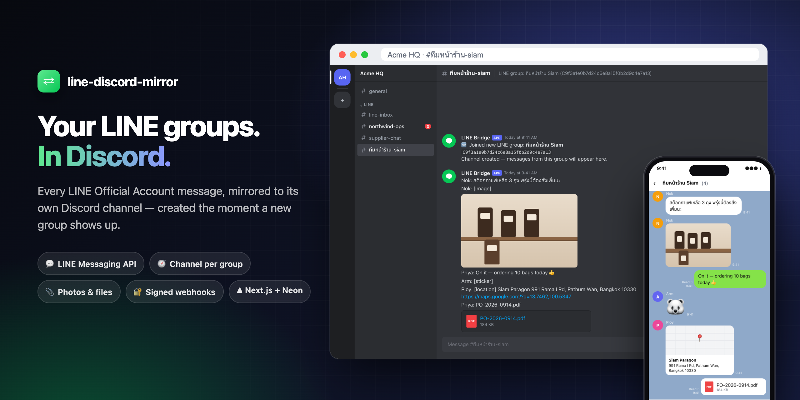
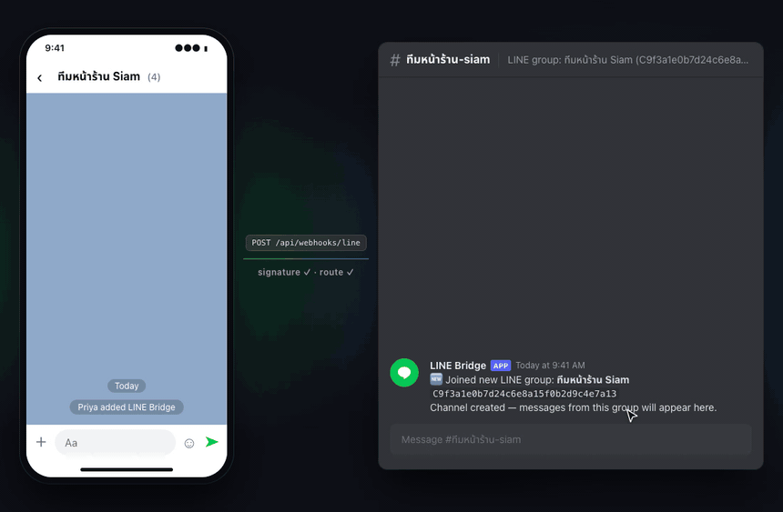
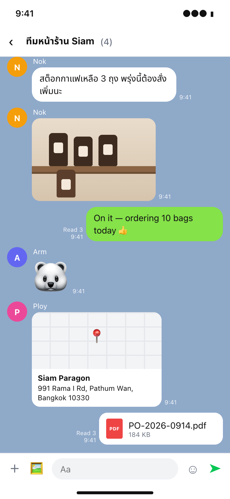
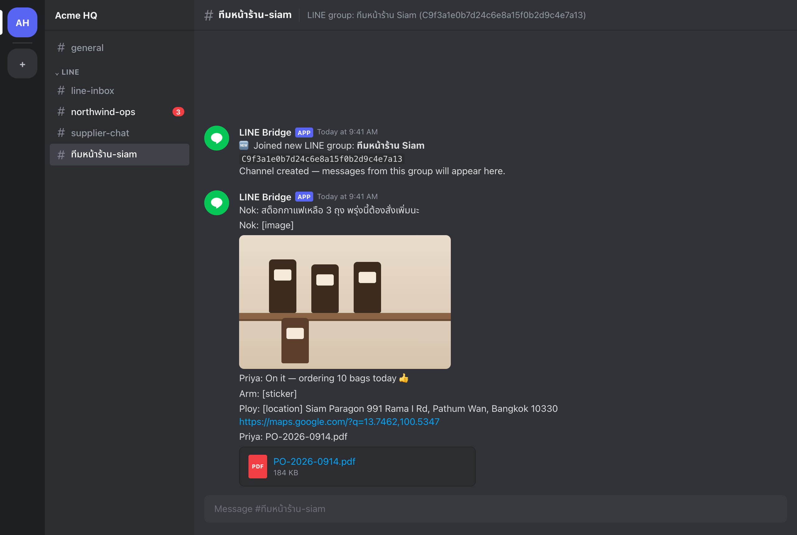
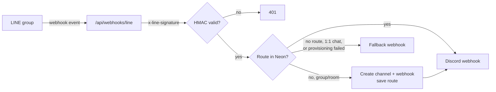

<div align="center">



# line-discord-mirror

**Every LINE Official Account message, mirrored into Discord — one channel per LINE group, created automatically.**

Add your LINE OA to a group. The next message from it lands in a fresh Discord channel with its own webhook.<br>
No bot commands, no config per group, no redeploy.

[](LICENSE)
[](https://nextjs.org)
[](tsconfig.json)
[](https://neon.tech)
[](package.json)

[](https://vercel.com/new/clone?repository-url=https%3A%2F%2Fgithub.com%2Ftlejay%2Fline-discord-mirror&project-name=line-discord-mirror&repository-name=line-discord-mirror&env=LINE_CHANNEL_SECRET,LINE_CHANNEL_ACCESS_TOKEN,DISCORD_BOT_TOKEN,DISCORD_GUILD_ID,DISCORD_LINE_CATEGORY_ID,DATABASE_URL)

[Features](#-what-you-get) · [Demo](#-see-it-in-action) · [Setup](#-setup) · [How it works](#-how-it-works) · [Env vars](#environment-variables)

</div>

---

## ✨ What you get

| Feature | What it does |
|---|---|
| 🧭 **A channel per LINE group** | The first time a new group (or multi-person room) shows up, the bot creates a Discord text channel under your chosen category, plus a `LINE Bridge` webhook in it. |
| ♻️ **Reuses what's there** | If a channel with the same name already exists, it's reused instead of duplicated — even if you moved it out of the category. |
| 🇹🇭 **Thai channel names** | Group names are slugged for Discord but Thai characters are kept: `ทีมหน้าร้าน Siam` → `#ทีมหน้าร้าน-siam`. |
| 🙋 **Real sender names** | Each line is posted as `Name: message`, with the display name looked up from LINE. |
| 📎 **Photos, video, audio, files** | Downloaded from LINE and re-uploaded to Discord (up to 8 MB). Larger files post a note with the size instead. |
| 📍 **Locations** | Posted with the place name, address and a Google Maps link. Stickers show as `[sticker]`. |
| 🔐 **Signed & safe** | Every request is checked against LINE's HMAC-SHA256 signature (timing-safe). Relayed text can't trigger `@everyone` or other mentions in Discord. |
| 🛟 **Never drops LINE** | LINE always gets a fast `200`, even if Discord is down, so LINE won't disable your webhook. Unrouted chats go to an optional fallback channel. |
| 🗄️ **Survives redeploys** | Routes live in one Postgres table (Neon), created on first use. Two messages racing for a new group can't create two channels. |

~550 lines of TypeScript, two runtime dependencies (`next`, `@neondatabase/serverless`).

## 🎬 See it in action

<div align="center">

</div>

> The visuals on this page are illustrations — this project has no UI of its own. The Discord text in them follows the exact format the webhook sends (see `forwardMessage` in [`route.ts`](app/api/webhooks/line/route.ts)).

<details>
<summary>Full-size stills</summary>

| LINE group | Discord channel |
|---|---|
|  |  |

</details>

## 🤔 This or something else?

| Aspect | **line-discord-mirror** | Two-way bridge bots | No-code (Zapier, Make…) |
|---|---|---|---|
| Direction | LINE → Discord only | Both ways | Depends on the recipe |
| New LINE group | Channel created automatically | Usually mapped by hand | A new route per group |
| Media | Re-uploaded as files | Varies | Often links only |
| Hosting | Your Vercel + Neon (free tiers work) | Your server | Their cloud, per-task pricing |

**Pick this** if Discord is where your team works and LINE is where your customers or field staff talk.
**Pick something else** if you need to reply from Discord back into LINE — this relay is deliberately one-way and silent.

---

## 🚀 Setup

### 1. Discord bot

1. [Discord Developer Portal](https://discord.com/developers/applications) → **New Application** → **Bot**. Copy the token → `DISCORD_BOT_TOKEN`.
2. Invite the bot to your server with the `bot` scope and **only** these permissions:
   - **Manage Channels** — to create mirror channels under the LINE category
   - **Manage Webhooks** — to create webhooks in those channels

   Do **not** grant Administrator.
3. Create a **Category** for the LINE channels.
4. Turn on Developer Mode (User Settings → Advanced), then:
   - right-click the server → **Copy Server ID** → `DISCORD_GUILD_ID`
   - right-click the category → **Copy Channel ID** → `DISCORD_LINE_CATEGORY_ID`
5. *(Recommended)* Create a webhook in a catch-all channel such as `#line-inbox` → `LINE_FALLBACK_WEBHOOK_URL`. See [Where messages go](#where-messages-go) for why.

### 2. Neon

1. Create a project at [neon.tech](https://neon.tech) (free tier works).
2. Copy the connection string → `DATABASE_URL`.
3. That's it. The `line_routes` table is created on the first request. [`migrations/001_init.sql`](migrations/001_init.sql) is there if you prefer to run it yourself.

### 3. Deploy to Vercel

Click **Deploy with Vercel** above, or:

```bash
git clone https://github.com/tlejay/line-discord-mirror
cd line-discord-mirror
pnpm install
vercel --prod
```

Then add the variables from [`.env.example`](.env.example) under **Settings → Environment Variables** and redeploy.

### 4. LINE Official Account

1. [LINE Developers Console](https://developers.line.biz/console/) → your **Messaging API** channel.
2. Copy the **Channel secret** → `LINE_CHANNEL_SECRET`.
3. Issue a **Channel access token (long-lived)** → `LINE_CHANNEL_ACCESS_TOKEN`.
4. Set **Webhook URL** to `https://<your-domain>/api/webhooks/line`, turn on **Use webhook**, click **Verify**.
5. Turn off **Auto-reply messages** and **Greeting messages** — the bot is a silent relay.
6. Allow the OA to join group chats, then add it to a group and say something.

---

## 🧩 How it works



### Where messages go

| Source | Goes to |
|---|---|
| Group or room with a saved route | Its own channel |
| New group or room | A channel is created on the **first message**, then it goes there |
| Bot added to a group (`join` event) | Channel created immediately and a 🆕 notice posted — **only when `LINE_FALLBACK_WEBHOOK_URL` is set**; otherwise creation waits for the first message |
| 1:1 chat with the OA | Fallback channel (1:1 chats don't get their own channel) |
| Group whose name LINE hasn't returned yet, or channel creation failed | Fallback channel, prefixed with `[Group name]` |

If no fallback webhook is set, messages that can't be routed are logged and dropped.

---

## Environment Variables

| Variable | Required | Description |
|---|---|---|
| `LINE_CHANNEL_SECRET` | ✅ | HMAC-SHA256 signing key from LINE |
| `LINE_CHANNEL_ACCESS_TOKEN` | ✅ | Long-lived token for the content, profile and group-summary APIs |
| `DISCORD_BOT_TOKEN` | ✅ | Bot token with Manage Channels + Manage Webhooks |
| `DISCORD_GUILD_ID` | ✅ | Discord server (guild) ID |
| `DISCORD_LINE_CATEGORY_ID` | ✅ | Category where mirror channels are created |
| `DATABASE_URL` | ✅ | Neon (Postgres) connection string |
| `LINE_FALLBACK_WEBHOOK_URL` | — | Discord webhook for unrouted chats; also enables channel creation on `join` |
| `LINE_ADMIN_TOKEN` | — | Protects the one-off `?seed` migration endpoint |
| `LINE_ROUTE_MAP` | — | Only for the migration below; remove afterwards |

## Migrating from env-var routing

If you previously stored routes in a `LINE_ROUTE_MAP` JSON variable
(`{"<groupId>":"https://discord.com/api/webhooks/..."}`), copy them into the database once:

```
GET /api/webhooks/line?seed=<LINE_ADMIN_TOKEN>
```

Set `LINE_ADMIN_TOKEN` and `LINE_ROUTE_MAP`, hit the endpoint, then remove `LINE_ROUTE_MAP`.
A plain `GET /api/webhooks/line` is a liveness check.

## Local development

```bash
cp .env.example .env.local   # fill in real values
pnpm dev
# expose it with ngrok (or similar) and point the LINE webhook URL at it
```

## Tests

```bash
pnpm test        # signature verification (5 cases)
pnpm typecheck
```

## Project layout

```
app/api/webhooks/line/route.ts   webhook: verify → route → forward
lib/line-routes.ts               Neon routes + Discord channel/webhook provisioning
lib/line-verify.ts               HMAC-SHA256 signature check
migrations/001_init.sql          optional manual schema
__tests__/verify.test.ts         signature tests
```

## Known limits

- One-way: nothing flows from Discord back to LINE.
- Stickers arrive as `[sticker]`, not the image.
- Edits and unsends in LINE are not mirrored.
- Uploads are capped at 8 MB per file.

## Contributing

Issues and PRs are welcome. Keep the relay silent and dependency-light. Run `pnpm test` and `pnpm typecheck` before opening a PR.

## License

MIT — see [LICENSE](LICENSE).

---

> **ภาษาไทย (สั้น ๆ)**
> รับ webhook จาก LINE OA แล้วส่งต่อทุกข้อความเข้า Discord อัตโนมัติ แต่ละกลุ่ม LINE ได้ห้อง Discord ของตัวเองทันทีที่มีข้อความแรก (ชื่อห้องภาษาไทยได้) ส่งรูป วิดีโอ ไฟล์ และโลเคชันต่อให้ด้วย เป็นทางเดียว ไม่ตอบกลับ และไม่มี AI ในเส้นทางนี้

<div align="center">

If this saved you from copy-pasting LINE chats into Discord, a ⭐ helps others find it.

</div>
